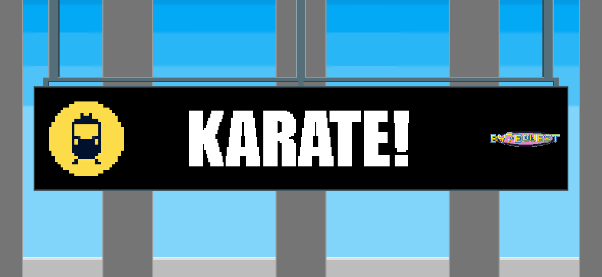
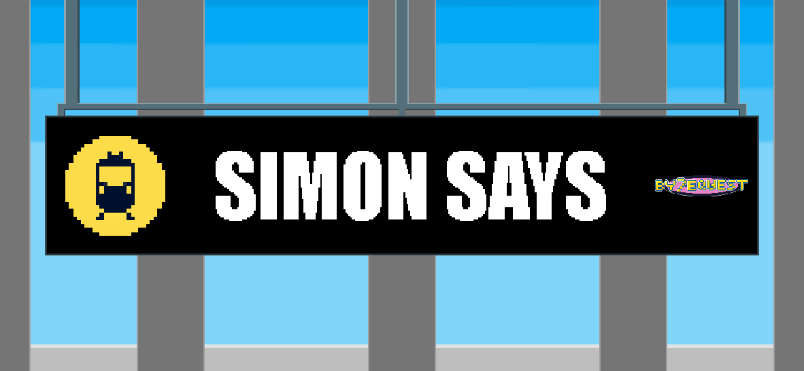
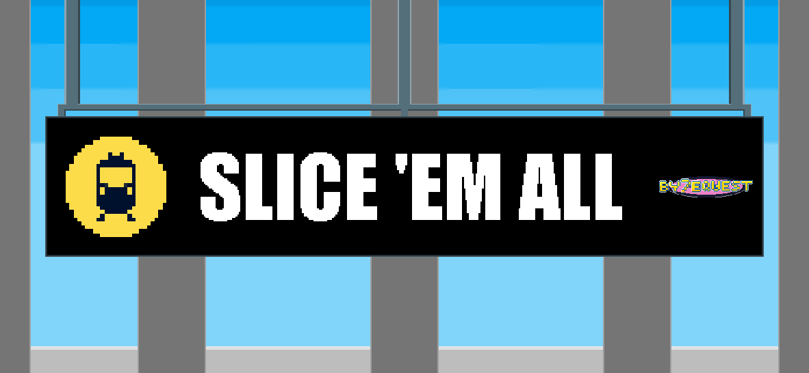

[![Contributors][contributors-shield]][contributors-url]
[![Forks][forks-shield]][forks-url]
[![Stargazers][stars-shield]][stars-url]
[![Issues][issues-shield]][issues-url]

 

  

<h3 align="center">By7eQuest</h3>

  

    A gamified Data Structures and Algorithms learning experience.
     
    <a href="https://github.com/mjcarant0/by7equest"><strong>Explore the docs »</strong></a>
     
     
    <a href="https://github.com/mjcarant0/by7equest/issues">Report Bug</a>
    ·
    <a href="https://github.com/mjcarant0/by7equest/issues">Request Feature</a>
  

  
Table of Contents

  <ol>
    <li><a href="#about-the-project">About The Project</a></li>
    <li><a href="#built-with">Built With</a></li>
    <li><a href="#getting-started">Getting Started</a></li>
    <li><a href="#usage">Usage</a></li>
    <li><a href="#roadmap">Roadmap</a></li>
    <li><a href="#meet-the-team">Meet the Team</a></li>
    <li><a href="#acknowledgments">Acknowledgments</a></li>
  </ol>

## About The Project
By7eQuest is a gamified approach to mastering Data Structures and Algorithms. It transforms complex concepts into interactive minigames to enhance student engagement and retention.

### Gameplay Gallery
| Karate (Stacks) | Simon Says (Linked List) | Slice 'Em All (Queues) |
| :---: | :---: | :---: |
|  |  |  |

(<a href="#readme-top">back to top</a>)

## Built With
* 
* 
* 

(<a href="#readme-top">back to top</a>)

## Getting Started
To get a local copy up and running, follow these steps:

1. Clone the repo: `git clone https://github.com/mjcarant0/by7equest.git`
2. Create an account at PlayFab and copy your unique Title ID.
3. Navigate to `Assets/Script/Database/`.
4. Locate `PlayFabSecrets.cs` (or create from example).
5. Set the Title ID to your unique ID.

(<a href="#readme-top">back to top</a>)

## Usage

By7eQuest aims to visualize abstract Data Structures and Algorithms (DSA) concepts through gamification.

### 🎓 Educational Objectives
* **Visual Learning:** Transforms theoretical concepts (Stacks, Queues, Linked Lists, Trees) into tangible gameplay mechanics.
* **Reflex Training:** Reinforces algorithmic thinking (LIFO vs. FIFO) under time pressure.
* **Competitive Analytics:** Utilizes a cloud-based leaderboard to track student performance and mastery levels.

### 🎮 Controls & Mechanics
The game is designed for **single-hand accessibility**, primarily using the Spacebar for rapid interactions.

| Action | Input | Context |
| :--- | :--- | :--- |
| **Interact / Confirm** | `Spacebar` | Used to Kick (Stack), Slice (Queue), and Select (Linked List). |
| **UI Navigation** | `Mouse Left Click` | Select Difficulty Mode and navigate menus. |
| **Exit Game** | `Esc` | Closes the application (Build mode only). |

(<a href="#readme-top">back to top</a>)

## Roadmap

- [x] **Phase 1: Core Systems & Architecture**
    - [x] Initialize Unity Project & GitHub Repository
    - [x] Implement Main Menu & Scene Management
    - [x] Design Global `GameModeManager` (Singleton Pattern)

- [x] **Phase 2: Data Structure Minigames**
    - [x] **Stack:** Develop "Karate!" (LIFO Mechanics)
    - [x] **Linked List:** Develop "Simon Says" (Sequential Node Logic)
    - [x] **Queue:** Develop "Slice 'Em All" (FIFO Spawning System)

- [x] **Phase 3: Backend & Integration**
    - [x] Set up Microsoft Azure / PlayFab Studio
    - [x] Implement Player Authentication (Login/Session)
    - [x] Create Cloud Leaderboard System

- [x] **Phase 4: Polish & Optimization**
    - [x] Add Background Music (BGM) & Sound Effects (SFX)
    - [x] Implement Difficulty Scaling (Easy, Medium, Hard, God Mode)
    - [x] Final QA Testing (Unit, Integration, & Sanity Checks)
    - [x] **Release v1.0**

(<a href="#readme-top">back to top</a>)

See the [open issues](https://github.com/mjcarant0/by7equest/issues) for a full list of proposed features.

(<a href="#readme-top">back to top</a>)

## 👥 Meet the Team

| Name | Role | GitHub | LinkedIn |
| :--- | :--- | :--- | :--- |
| **Marjoy M. Caranto** | Team Lead, UI/UX Lead, & Programmer | [@mjcarant0](https://github.com/mjcarant0) | [![LinkedIn][linkedin-shield]][linkedin-mj] |
| **Francen Venisse E. Red** | QA Lead & Organizer | [@Francen-Red](https://github.com/Francen-Red) | [![LinkedIn][linkedin-shield]][linkedin-francen] |
| **John Reydo A. Tinawin** | Game Writer & Documentation | [@jrtinawin16](https://github.com/jrtinawin16) | [![LinkedIn][linkedin-shield]][linkedin-john] |
| **Margaret Sydney S. Laylo** | Programmer | [@dnlaylo](https://github.com/dnlaylo) | [![LinkedIn][linkedin-shield]][linkedin-margaret] |
| **Mary Ruth P. Relator** | Programmer | [@MaryRuth17](https://github.com/MaryRuth17) | [![LinkedIn][linkedin-shield]][linkedin-mary] |
| **Danielle Carl R. Diamante** | Audio Director | [@Carl-dc09](https://github.com/Carl-dc09) | - |
| **Marian May Legaspi** | Game Designer & UI/UX Co-Lead | [@marianlegaspi-kuyarix](https://github.com/marianlegaspi-kuyarix) | [![LinkedIn][linkedin-shield]][linkedin-marian] |

**Project Link:** [https://github.com/mjcarant0/by7equest](https://github.com/mjcarant0/by7equest)

[linkedin-shield]: https://img.shields.io/badge/-LinkedIn-black.svg?style=for-the-badge&logo=linkedin&colorB=555

[linkedin-mj]: https://www.linkedin.com/in/marjoycaranto/
[linkedin-francen]: https://www.linkedin.com/in/francen-venisse-red-1021r2005/
[linkedin-john]: https://www.linkedin.com/in/john-reydo-97b26617b/
[linkedin-margaret]: https://ph.linkedin.com/in/laylomarga
[linkedin-mary]: https://www.linkedin.com/in/maryruthprelator/
[linkedin-marian]: https://www.linkedin.com/in/marian-may-legaspi-89a138330/

(<a href="#readme-top">back to top</a>)

## Acknowledgments

* [PlayFab Documentation](https://learn.microsoft.com/en-us/gaming/playfab/) for database integration support.
* [Unity Documentation](https://docs.unity3d.com/Manual/index.html) for engine and C# guidance.

(<a href="#readme-top">back to top</a>)

[contributors-shield]: https://img.shields.io/github/contributors/mjcarant0/by7equest.svg?style=for-the-badge
[contributors-url]: https://github.com/mjcarant0/by7equest/graphs/contributors
[forks-shield]: https://img.shields.io/github/forks/mjcarant0/by7equest.svg?style=for-the-badge
[forks-url]: https://github.com/mjcarant0/by7equest/network/members
[stars-shield]: https://img.shields.io/github/stars/mjcarant0/by7equest.svg?style=for-the-badge
[stars-url]: https://github.com/mjcarant0/by7equest/stargazers
[issues-shield]: https://img.shields.io/github/issues/mjcarant0/by7equest.svg?style=for-the-badge
[issues-url]: https://github.com/mjcarant0/by7equest/issues